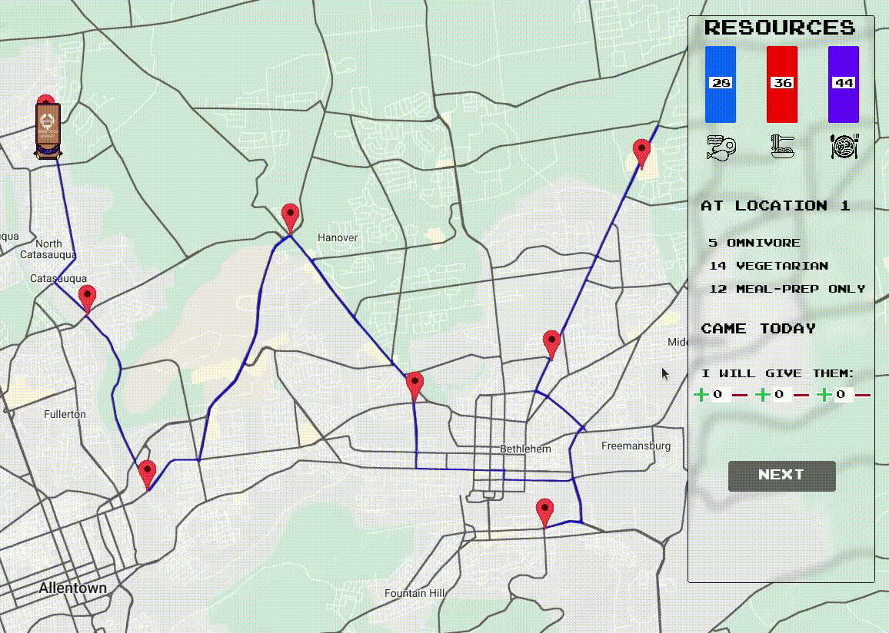

# The Mobile Food Bank Game

"The Mobile Food Bank Game" developed based on the problem tackled in [the paper](https://arxiv.org/abs/2105.05308) by Sinclair et al. The purpose of the game is to show the students the trade-off between efficiency (minimizing waste) and fairness in the case of sequential allocation.

## About the game

Due to the pandemic, the Lehigh food bank set up a mobile pantry that travels to 8 different locations in the Lehigh Valley, PA. You play as the operator of the mobile pantry. At each location, you need to choose how much food (meat, pasta, and prepared meals) to give to people who show up. They can be classified based of dietary preferences to: omnivores, vegetarians, and meal-prep. For the sake of simplicity, omnivores only eat meat, vegetarians only eat pasta, and meal-prep only eat prepared meals. Therefore the amount of meat chosen will be  equally distributed and given the omnivores , and so on. Since you have limited ressources, once you leave a location (hit "Next" in the game), there is no going back and the food left at the end goes to waste, so make your choices wisely!

In the first round, your are only evaluated based on the amount of food left at the end of the game. However, the second round includes a fairness score as well as satisfaction level (using ,  , ,   and ) of the visitors of each location. 

##  Teaching using the game

We suggest the following plan:

1. Introduce the game and its rules
2. Have the students play the first round (no fairness)
3. Brainstorm fairness measures and introduce Envy-freeness
4. Have the students play the second round and save their scores
5. Explain the optimization problem "solved" in each round
6. Plot efficiency x-axis vs fairness y-axis scores to show the trade-off between the two

## Requirements

* Python >= 3.8
* Numpy
* Pygame
